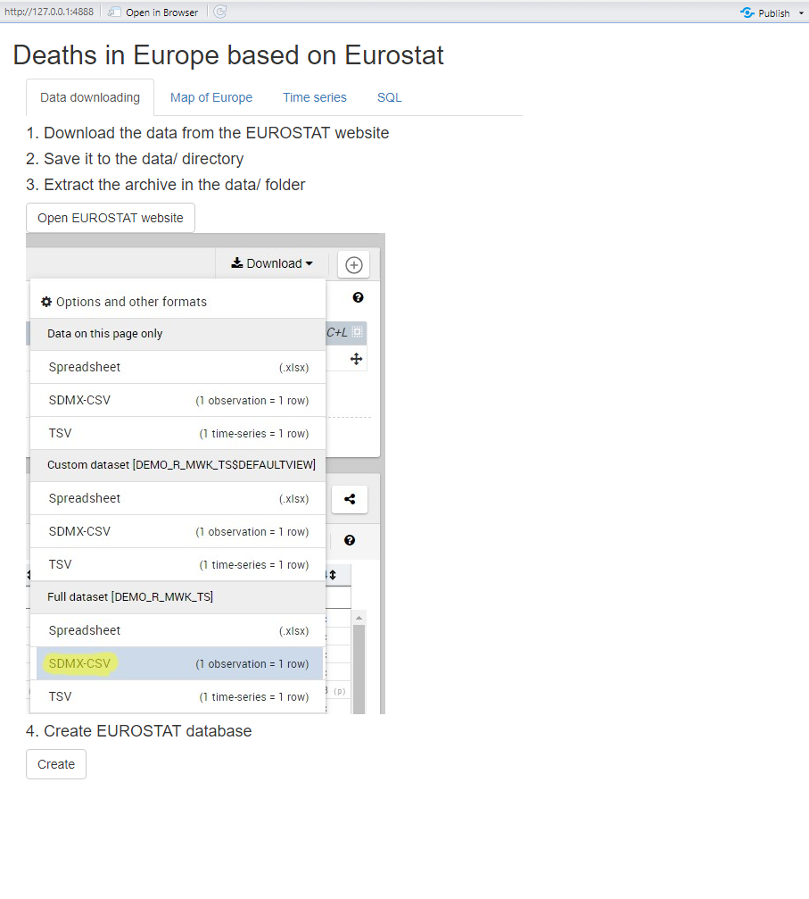
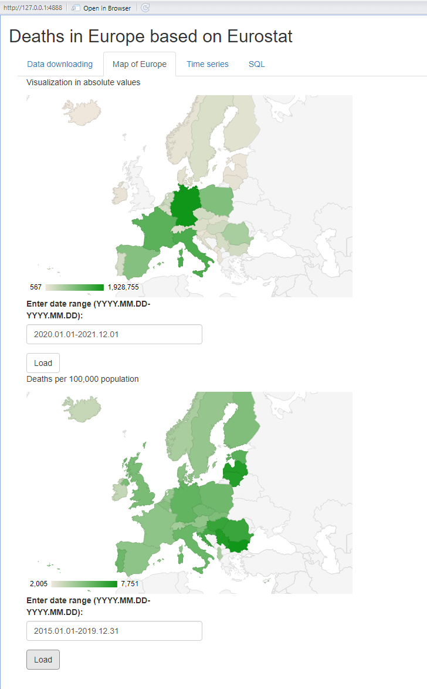
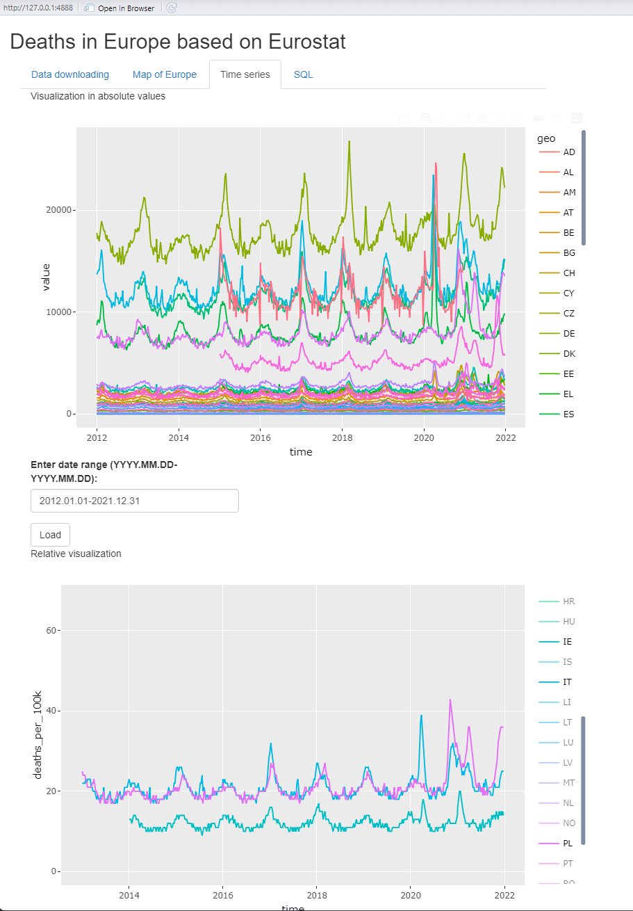
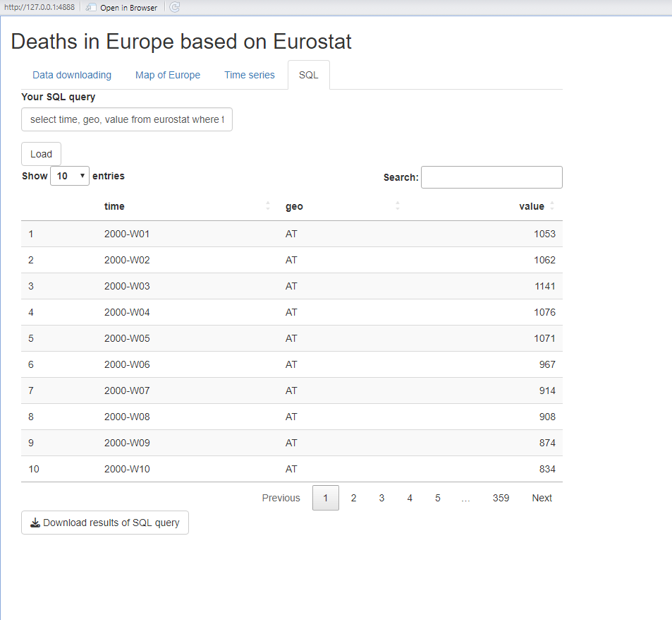

# Eurostat

The project in Shiny creates an interactive visualization of death statistics in Europe based on data from Eurostat.

### Data

The data comes from the Eurostat website and includes raw weekly statistics on deaths in Europe by country, gender and date.

https://ec.europa.eu/eurostat/databrowser/view/DEMO_R_MWK_TS/default/table?lang=en

### Main features

- The application creates a cleaned database from raw csv file, which can be explored later
- Next tab shows a map of Europe with plotted statistics by country for a specific date range selected by user. The first map shows absolute values, the second in relation to 100,000 population. The map is interactive, it is possible to choose any time interval from 2000 to 2023
- Another tab shows time series for the selected time interval in absoulte and relative values. The plots are interactive, it is possible to dynamically change date ranges, zoom in on data, select certain countries for analysis
- The last tab can dynamically generate a table based on any SQL query entered by the user. Such table can be viewed or exported to a csv file

### Techniques

The project was written using the R language and libraries: shiny, ggplot2, googleVis, RSQlite, plotly.

### Examples:

